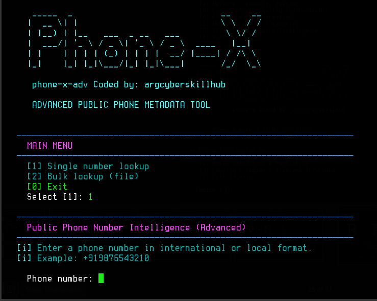

📱 Phone-X

Phone-X is a terminal-based public phone-number metadata tool for validation, formatting, region, timezone, and carrier metadata.

✨ Features
🌍 Country / region detection
📞 Number validation
🔢 E.164 / International / National format
📡 Carrier metadata
🕐 Timezone metadata
📱 Number type detection
📄 JSON / TXT export
🎨 Colored CLI UI
📦 Install


```bash
git clone https://github.com/argcyberskillhub/Phone-X.git
```


```bash
cd Phone-X
```

```bash
pip install phonenumbers
```
or

```bash
pip install requirements.txt
```

🚀 Run

```bash
python Phone-X.py
```

📱 Phone-X

<p align="center">
  
</p>


🔎 Example
Phone number: +12025550147
Default region: IN


Example output:

Input          +12025550147
Valid          YES
Type           FIXED_LINE
Country        United States
Region         US
Calling Code   +1
Timezone       America/New_York

🖼️ Screenshot

⚠️ Disclaimer

This tool uses public numbering-plan metadata only. It does not identify private subscribers, reveal private records, or provide live device location.

Coded by argcyberskillhub
